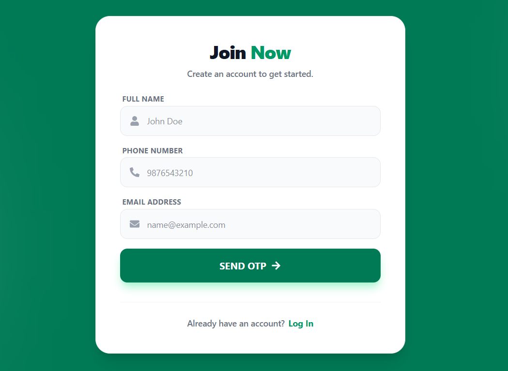
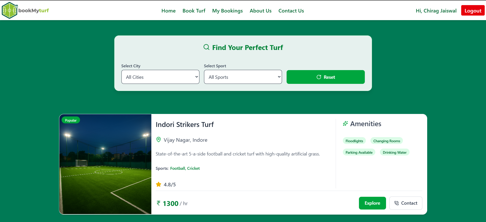
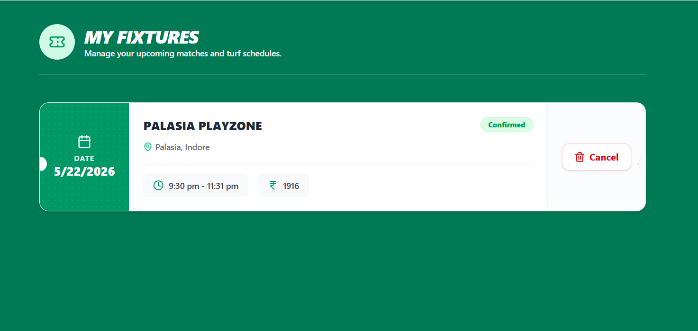
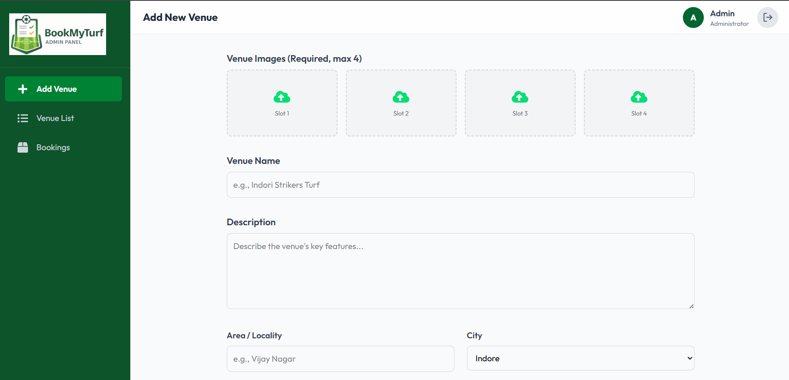

# 🏟️ BookMyTurf — Turf Booking Platform

A full-stack **MERN-based sports venue booking platform** that enables users to discover turfs, book available time slots, authenticate securely using Email OTP, and manage their bookings. The project also includes a dedicated **Admin Dashboard** for managing venues, bookings, booking statuses, refunds, and real-time booking notifications.

## 🚀 Live Features

### 👤 User Features

* 🔐 Secure Email OTP Authentication
* 📝 User Registration and Login
* 🏟️ Browse Available Sports Turfs
* 🔍 Search and Select Sports Venues
* 📅 Select Booking Date and Time Slot
* 📖 View Detailed Turf Information
* 🎟️ Book Sports Venues
* 📋 View Personal Bookings
* ❌ Cancel Bookings
* 📧 Booking-related Email Notifications
* 🔒 Protected Routes using JWT Authentication

### 🛠️ Admin Features

* 📊 Dedicated Admin Dashboard
* ➕ Add New Venues
* 📝 Update Venue Information
* 🗑️ Remove Venues
* 📋 View All Bookings
* 🔄 Update Booking Status
* 💰 Manage Refund Status
* 🔔 Real-Time New Booking Notifications
* 🔊 Notification Sound for New Bookings
* 📡 Real-Time Communication using Socket.IO

## 🖼️ Screenshots

### 🏠 Home Page


### 🔐 OTP Authentication



### 🏟️ Turf Details



### 📋 My Bookings



### 🛠️ Admin Dashboard



> **Note:** Create a `screenshots` folder in the repository root and add your project screenshots using the filenames shown above.

---

# 🧰 Tech Stack

## Frontend

* React.js
* Vite
* Tailwind CSS
* React Router DOM
* Axios
* React Toastify
* React Icons

## Backend

* Node.js
* Express.js
* MongoDB
* Mongoose
* JSON Web Token (JWT)
* bcrypt
* Nodemailer
* Socket.IO

## Admin Panel

* React.js
* Vite
* Tailwind CSS
* Axios
* Socket.IO Client

---

# 📂 Project Structure

```text
BookMyTurf/
│
├── frontend/
│   ├── src/
│   │   ├── components/
│   │   ├── pages/
│   │   ├── data/
│   │   ├── App.jsx
│   │   └── main.jsx
│   ├── Images/
│   ├── package.json
│   └── vite.config.js
│
├── backend/
│   ├── config/
│   ├── controllers/
│   ├── middleware/
│   ├── models/
│   ├── routes/
│   ├── utils/
│   ├── socket.js
│   ├── index.js
│   └── package.json
│
├── admin/
│   ├── src/
│   │   ├── components/
│   │   ├── pages/
│   │   ├── App.jsx
│   │   └── main.jsx
│   ├── assets/
│   └── package.json
│
├── .gitignore
└── README.md
```

# ⚙️ Installation and Setup

## 1️⃣ Clone the Repository

```bash
git clone https://github.com/chirag-jaiswal-git/BookMyTurf.git
```

Move into the project directory:

```bash
cd BookMyTurf
```

---

## 2️⃣ Setup Backend

```bash
cd backend
npm install
```

Create a `.env` file inside the `backend` folder:

```env
PORT=4000

MONGODB_URI=your_mongodb_connection_string

JWT_SECRET=your_jwt_secret

ADMIN_EMAIL=your_admin_email
ADMIN_PASSWORD=your_admin_password

EMAIL_USER=your_email
EMAIL_PASS=your_email_app_password
```

Start the backend server:

```bash
npm run server
```

or:

```bash
npm start
```

---

## 3️⃣ Setup User Frontend

Open a new terminal:

```bash
cd frontend
npm install
```

Create a `.env` file:

```env
VITE_BACKEND_URL=http://localhost:4000
```

Start the frontend:

```bash
npm run dev
```

---

## 4️⃣ Setup Admin Panel

Open another terminal:

```bash
cd admin
npm install
```

Start the admin panel:

```bash
npm run dev
```

---

# 🔐 Environment Variables

| Variable           | Description                        |
| ------------------ | ---------------------------------- |
| `PORT`             | Backend server port                |
| `MONGODB_URI`      | MongoDB connection string          |
| `JWT_SECRET`       | Secret key for JWT authentication  |
| `ADMIN_EMAIL`      | Admin login email                  |
| `ADMIN_PASSWORD`   | Admin login password               |
| `EMAIL_USER`       | Email address used for sending OTP |
| `EMAIL_PASS`       | Email app password                 |
| `VITE_BACKEND_URL` | Backend API URL for frontend       |

# 🔄 Authentication Flow

```text
User
  ↓
Enter Email
  ↓
Request OTP
  ↓
Backend Generates OTP
  ↓
OTP Sent via Email
  ↓
User Enters OTP
  ↓
OTP Verified
  ↓
JWT Token Generated
  ↓
User Logged In
```

# 📅 Booking Flow

```text
User
  ↓
Select Turf
  ↓
Choose Date
  ↓
Select Time Slot
  ↓
Confirm Booking
  ↓
Booking Stored in MongoDB
  ↓
Admin Receives Real-Time Notification
  ↓
Booking Appears in Admin Dashboard
```

# 🔔 Real-Time Notifications

The Admin Dashboard uses **Socket.IO** to receive new booking events in real time.

When a user makes a booking:

```text
User Creates Booking
        ↓
Backend Saves Booking
        ↓
Socket.IO Emits "newBooking"
        ↓
Admin Dashboard Receives Event
        ↓
Notification Toast Appears
        ↓
Notification Sound Plays
        ↓
Booking List Updates Automatically
```

# 🔒 Security Features

* Password-free Email OTP authentication
* OTP expiration support
* Hashed OTP using bcrypt
* JWT-based authorization
* Protected user routes
* Admin authentication
* Secure API communication
* Environment variables for sensitive credentials

# 🎯 Future Improvements

* 💳 Online Payment Integration
* 🤖 AI Chatbot for User Support
* ⭐ Venue Reviews and Ratings
* 📍 Google Maps Integration
* 📱 Improved Mobile Experience
* 📊 Advanced Admin Analytics
* 🔔 Push Notifications
* 🎫 Discount and Coupon System
* 🏆 Tournament Management
* 📧 Enhanced Booking Email Templates

# 👨‍💻 Author

**Chirag Jaiswal**

* GitHub: https://github.com/chirag-jaiswal-git
* LinkedIn: https://www.linkedin.com/in/chirag-jaiswal18/

# ⭐ Support

If you found this project useful, please consider giving the repository a **star ⭐**.

---

## 📄 License

This project is developed for educational and learning purposes.

---

<p align="center">
  Made with ❤️ using the MERN Stack
</p>

<p align="center">
  🏟️ <strong>BookMyTurf</strong> — Book Your Game. Play Without Limits.
</p>
